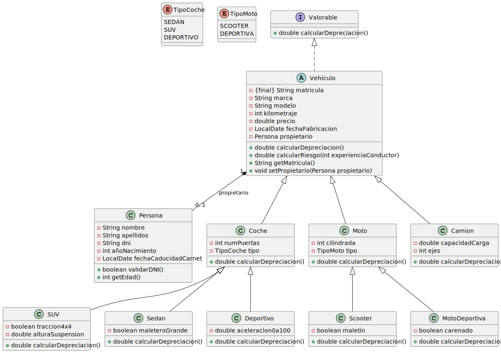

# UT5_ED_Prog

## Checklist

- [x] Crear estructura base del repositorio
- [x] Modelar clase abstracta Vehículo
- [x] Implementar subclases concretas (Coche, Moto, Camión)
- [x] Crear subtipos específicos (Sedán, SUV, Deportivo, Scooter, Deportiva)
- [x] Diseñar clase Persona con validación de DNI
- [x] Establecer relación de composición entre Vehículo y Persona
- [x] Implementar interfaz Valorable
- [x] Añadir método de cálculo de riesgo
- [x] Generar diagrama UML en formato SVG
- [ ] (Opcional) Implementar código Java correspondiente

## Diagrama de clases

